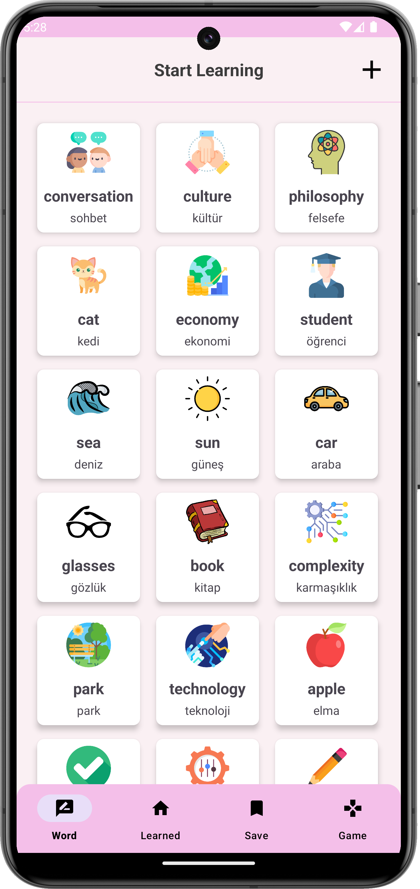
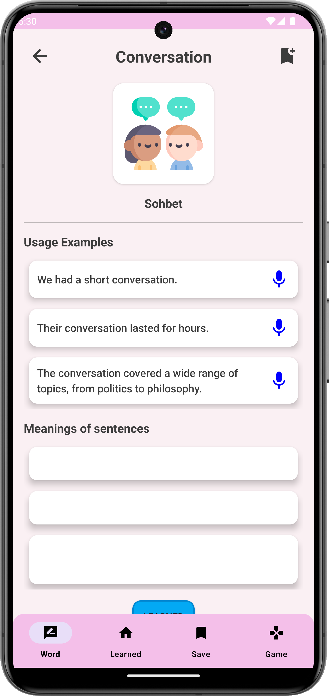
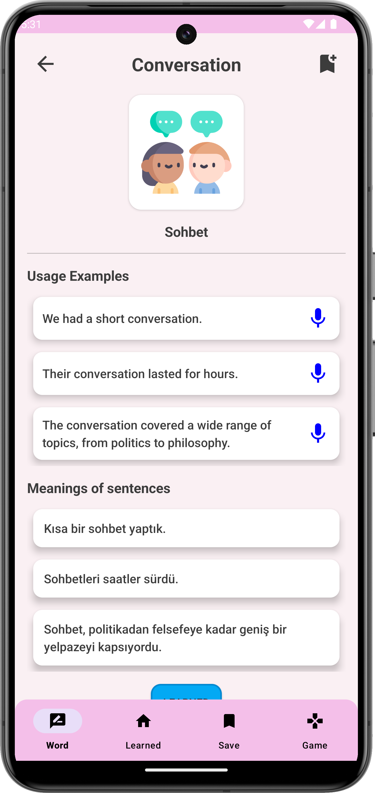
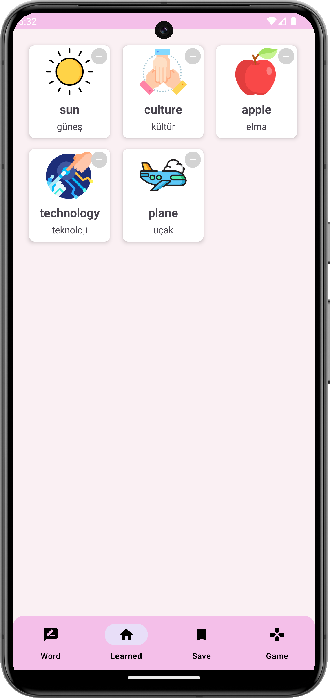
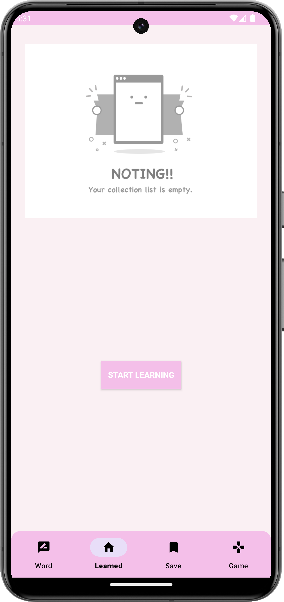
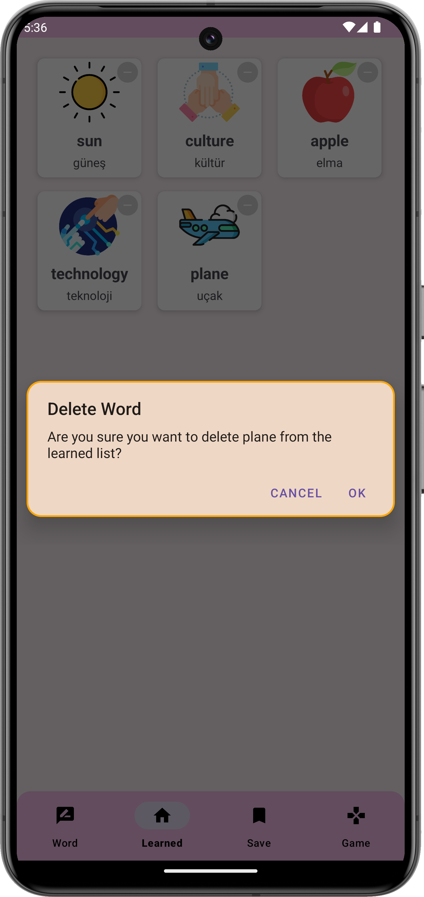
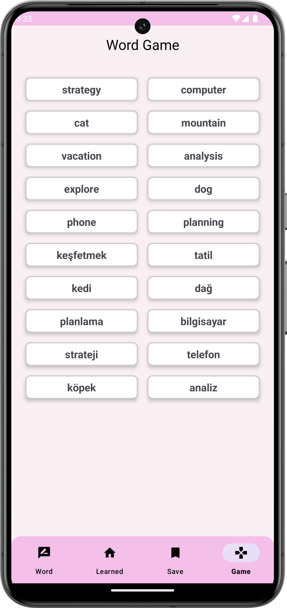

# Word Of Worlds

## Overview

[Eng] This project is an Android mobile application designed to help users learn English. Upon entering the app, users can memorize words, add their own custom words, listen to pronunciations, save words to a personal list for easier access, and make learning more enjoyable through engaging games. Additionally, users can view example sentences related to the words. With these features, the app provides a user-friendly and educational platform for anyone looking to enhance their English vocabulary.

[Tr] Bu proje, İngilizce öğrenmeye yönelik bir Android mobil uygulamasıdır. Kullanıcılar uygulamaya giriş yaptıklarında kelime ezberleyebilir, kendi kelimelerini ekleyebilir, kelimelerin telaffuzlarını dinleyebilir, kelimeleri kayıt edip kişisel listelerine ekleyebilir ve böylece daha kolay erişebilirler. Ayrıca oyunlar oynayarak öğrenme sürecini eğlenceli hale getirebilir ve kelimelerle ilgili örnek cümleler görebilirler. İngilizce öğrenme sürecini destekleyen bu çeşitli fonksiyonlarla donatılmış, kullanıcı dostu ve eğitici bir mobil uygulama olduğunu düşünüyorum.

## 🚀 Project Features
- **MVVM**
- **BOTTOM-NAVIGATION** 
- **HILT**
- **SHARED-PREFERENCES**
- **GSON**
- **FLOW**
- **GLIDE**
- **FRAGMENT**
- **UNIT TEST**

## 📸 Screenshots

|  |  |  |
|:-----------------------------------------------------------------:|:------------------------------------------------------------------------:|:-----------------------------------------------------------------------------:|
|                           **WORD PAGE**                           |                           **WORD DETAIL PAGE**                           |                             **WORD DETAIL PAGE**                              |

|  |  |  |
|:---------------------------------------------------------------------:|:-------------------------------------------------------------------------:|:------------------------------------------------------------------:|
|                           **LEARNING PAGE**                           |                              **EMPTY PAGE**                               |                             **POP-UP**                             |

|  |  
|:----------------------------------------------------------------------:|
|                           **WORD GAME PAGE**                           |                                       

